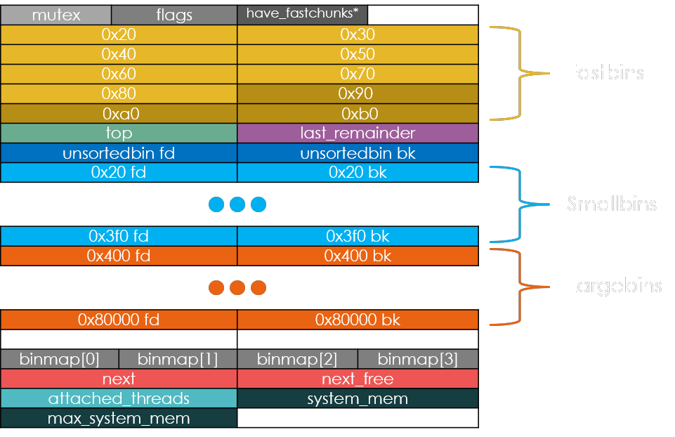

## Malloc and Free Notes(ptmalloc):
---

### Chunks:
Allocated chunk:
```
    chunk-> +-+-+-+-+-+-+-+-+-+-+-+-+-+-+-+-+-+-+-+-+-+-+-+-+-+-+-+-+-+-+-+-+
            |             Size of previous chunk, if unallocated (P clear)  |
            +-+-+-+-+-+-+-+-+-+-+-+-+-+-+-+-+-+-+-+-+-+-+-+-+-+-+-+-+-+-+-+-+
            |             Size of chunk, in bytes                     |A|M|P|
      mem-> +-+-+-+-+-+-+-+-+-+-+-+-+-+-+-+-+-+-+-+-+-+-+-+-+-+-+-+-+-+-+-+-+
            |             User data starts here...                          .
            .                                                               .
            .             (malloc_usable_size() bytes)                      .
            .                                                               |
nextchunk-> +-+-+-+-+-+-+-+-+-+-+-+-+-+-+-+-+-+-+-+-+-+-+-+-+-+-+-+-+-+-+-+-+
            |             (size of chunk, but used for application data)    |
            +-+-+-+-+-+-+-+-+-+-+-+-+-+-+-+-+-+-+-+-+-+-+-+-+-+-+-+-+-+-+-+-+
            |             Size of next chunk, in bytes                |A|0|1|
            +-+-+-+-+-+-+-+-+-+-+-+-+-+-+-+-+-+-+-+-+-+-+-+-+-+-+-+-+-+-+-+-+
```

Free chunk:
```
    chunk-> +-+-+-+-+-+-+-+-+-+-+-+-+-+-+-+-+-+-+-+-+-+-+-+-+-+-+-+-+-+-+-+-+
            |             Size of previous chunk, if unallocated (P clear)  |
            +-+-+-+-+-+-+-+-+-+-+-+-+-+-+-+-+-+-+-+-+-+-+-+-+-+-+-+-+-+-+-+-+
    `head:' |             Size of chunk, in bytes                     |A|0|P|
      mem-> +-+-+-+-+-+-+-+-+-+-+-+-+-+-+-+-+-+-+-+-+-+-+-+-+-+-+-+-+-+-+-+-+
            |             Forward pointer to next chunk in list             |
            +-+-+-+-+-+-+-+-+-+-+-+-+-+-+-+-+-+-+-+-+-+-+-+-+-+-+-+-+-+-+-+-+
            |             Back pointer to previous chunk in list            |
            +-+-+-+-+-+-+-+-+-+-+-+-+-+-+-+-+-+-+-+-+-+-+-+-+-+-+-+-+-+-+-+-+
            |             Unused space (may be 0 bytes long)                .
            .                                                               .
            .                                                               |
nextchunk-> +-+-+-+-+-+-+-+-+-+-+-+-+-+-+-+-+-+-+-+-+-+-+-+-+-+-+-+-+-+-+-+-+
    `foot:' |             Size of chunk, in bytes                           |
            +-+-+-+-+-+-+-+-+-+-+-+-+-+-+-+-+-+-+-+-+-+-+-+-+-+-+-+-+-+-+-+-+
            |             Size of next chunk, in bytes                |A|0|0|
            +-+-+-+-+-+-+-+-+-+-+-+-+-+-+-+-+-+-+-+-+-+-+-+-+-+-+-+-+-+-+-+-+
```

### Flags (bits):

* P (PREV_INUSE): 0; when the previous chunk unallocated/ free. 1; if its allocated.
* M (IS_MAPPED): obtained through the mmap syscall. ITs not in the arena or next to a free chunk.
* A (NON_MAIN_ARENA): 0; for the chink in the main arena.

### Arenas:

* region of memory for each thread to access information about their heap chunks.


* there is a global variable that points to the main arena or malloc_state.

### Bins:

* bins[] contains 3 different kinds of bins.
    ```
    bins[1] => unsorted bins
    bins[0] => unused
    small bins and large bins.
    ```

* Each free chunk is stored based on their size in the specific free lists, so allocator can access them quickly.
    ### Fastbins:
    * No of fastbins are defined by the 'NFASTBINS'.
    * these are singly linked lists and the chunks in each list are all the same size.
    * x64: 0x20 - 0x80 by default. increment of 0x10(16 bytes).
    * LIFO manner.

    ### Small bins:
    * There are 62 small bins (index 2 - 63), all doubly linked list.
    * bin with index n has a chunk size of (16n, 16n+16).
    * FIFO manner.

    ### Large bins:
    * 63 large bins 64-127, doubly linked list.
    * size is around 1024B to 128KB.

### t-cache:

* Singly linked list each thread having a list header for different sized allocations.

## Attacks on Glibc:

## Unsafe unlink:

### Checks:     
* P->FD->BK = p and P->BK->FD = P
* fd_nextsize should be 0 to avoid many checks.

### Conditions:
* have a pointer at a known location to a region you can call unlink on.
* create a bigger chunk (so not in fastbin, tcache range).
* have some overflow in the chunk0 so we change the meta data of chunk1.

### idea:

chunk0 = malloc(size)
chunk1 = malloc(size)

* create a fake chunk in the chunk0.

* make FD (forward pointer) of fake chunk = near address of chunk0 (-24 bytes from it exactly), this will make the chunk->fd->bk = chunk.
* make the BK (backward pointer) of the fake chunk = near the address of the chunk0 (-16).
* change the pre_size field of chunk1 to make free think out above free chunk starts from our fake chunk. set prev in use as 0.
* now free the chunk1 it will be consolidated.
* overwrite in the the chunk0 to point to an arbitrary location.
